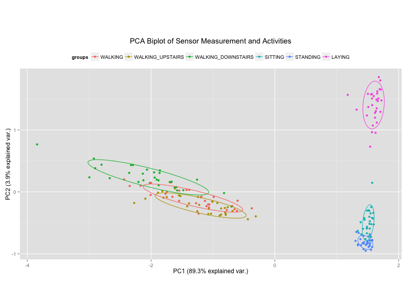

# Overview

The purpose of this exercise is to utilize the dataset that was created in the course project for the John Hopkins Getting and Cleaning Data course on Coursera to train a classifier (Decision Tree) to make predictions on the activities that subjects are performing based on subject's summarized sensor data.

Below are the library and source dependencies:


```r
library(caret)
library(randomForest)
library(ggbiplot)
library(knitr)

# Relies on the tidy dataset generated in run_analysis.R
source("./run_analysis.R")
```


## Making Predictions

The code above partitions the data using random samples to generate a training and testing sets (75% and 25% respectively).  The code then goes on to use the training data to create a randomForest decision model to predict the activity based on the sensor data.  The model is then used to make predictions on the testing set and finally a confusion matrix is used to summarize the accuracy of the predictions.


```r
# Seed the PRNG for reproducible results
set.seed(1440)

# Get sample indices of 75% of the dataset
train_idx <- sample(nrow(data), nrow(data) * 0.75)

# Subset the training dataset
data.train <- data[train_idx, -1]

# Subset the testing dataset
data.test <- data[-train_idx, -1]

# Use randomForest to create a decision tree model on the training data
data.rf <- randomForest(activity ~ ., data.train)

# Predict test labels based on model generated on training set
data.pred <- predict(data.rf, newdata = data.test[2:ncol(data.test)])

# Generate confusion matrix to compare the predicted labels with the actual labels
output <-confusionMatrix(data.test$activity, data.pred)
```


Below is the confusion matrix that shows the intersection of the actuals versus the predicted:


|Pred/Act|WALKING|WALKING_UPSTAIRS|WALKING_DOWNSTAIRS| SITTING|STANDING|LAYING|
|-------|-------|----------------|------------------|--------|--------|------|
|**WALKING**|              9     |             0         |           0    |     0          |0     |   0|
|**WALKING_UPSTAIRS**|       0          |        6         |           0     |    0          |0    |    0|
|**WALKING_DOWNSTAIRS**    |      0          |        0         |           7    |     0          |0     |   0|
|**SITTING**        |             0        |          0         |           0    |     6          |1     |   0|
|**STANDING**    |                0          |        0          |          0    |     0         |10     |   0|
|**LAYING**       |               0        |          0           |         0     |    0          |0    |    6|

In this scenario, the actual labels lie along the top of the table and the predicted labels along the left-hand side.  The diagonal from the upper-left hand corner down to the bottom-right are where the predictions match the actuals.  From this table, we can see that the model misclassified one instance as `SITTING` when it was actually `STANDING`.

## Dimensionality Reduction

There are 66 numerical attributes in the dataset which represent summarized values from a host of sensor measurements recorded from subjects mobile phones when performing a number of activities.  In this section, i'll use to Principal Component Analysis to reduce the attributes (column-wise) to the first 2 components to see if I'm able to visually recognize the cluster of activities.  In the second part, I will use a number of the components to build the same classifier used on all on the attributes and compare the performance.


```r
data.pca <- prcomp(data[3:ncol(data)], center = T, scale. = F)

ggbiplot(data.pca, obs.scale = 0.5, var.scale = 0.5, groups = data$activity, ellipse = T, var.axes = F) + 
  theme(legend.position="top") +
  ggtitle("PCA Biplot of Sensor Measurement and Activities")
```

<center></center>

The above is a scatterplot of the values between the first and second principal components (PC1 and PC2).  These two components are able to explain roughly 93% of the variance in the data, which is pretty good considering that two components can replace 66 attributes and still have 93% of the explanatory power.

We'll now use the principal components to build to model Random Forests and compare the prediction accuracy to using all of using the original dataset.


```r
results = output$overall

for (components in 2:4) {
  
  pca.rf <- randomForest(data.pca$x[train_idx, 1:components], data.train$activity)
  pca.pd <- predict(pca.rf, data.pca$x[-train_idx,1:components])
  results = cbind(results, confusionMatrix(pca.pd, data.test$activity)$overall)

}
```

The code above creates a random forest using 2, 3 and 4 Principal Components and tests the predictions made against the test labels.  Below is a table comparing the performance metrics of the models against the model created earlier that used all of the attributes.  Using 4 of the principal components results in a model that compared quite well (95.6% accuracy) to a model using 66 attributes (97.8% accuracy).


|                |     All |  2 Component |   3 Component| 4 Component |
|--------------- | ------- | ------------ | ------------ | ------------|
|Accuracy        |  0.9778 |       0.7556 |      0.8000  |      0.9556 |
|Kappa           |  0.9731 |       0.7052 |      0.7576  |      0.9462 |
|AccuracyLower   |  0.8823 |       0.6046 |      0.6540  |      0.8485 |
|AccuracyUpper   |  0.9994 |       0.8712 |      0.9042  |      0.9946 |
|AccuracyNull    |  0.2444 |      0.2222  |      0.2222  |      0.2222 |
|AccuracyPValue  |  0.0000 |      0.0000  |     0.0000   |      0.0000 |
|McnemarPValue   |     NaN |         NaN  |         NaN  |      NaN    |


